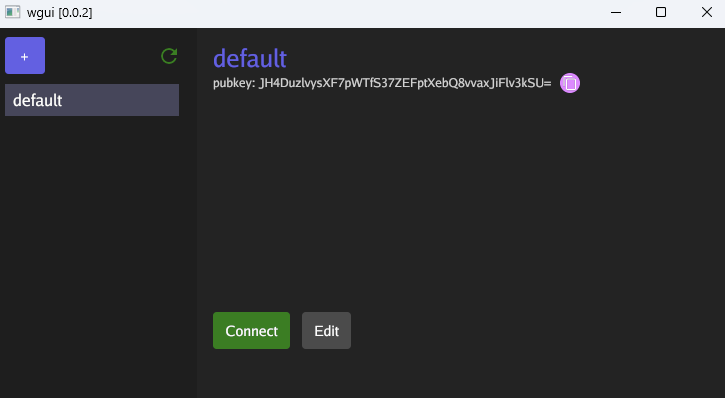

# wgui

`wgui` is a simple graphical user interface for [wgu][wgu] that helps you manage and control WireGuard VPN tunnels.



## Features

- Create, save, and edit multiple wgu configurations
- Easily manage multiple tunnels from the comfort of a shiny gui ✨

## Supported Systems

Windows and macOS are currently supported. The application can also be built from source; see [below](#installation-from-source) for details.

## Installation

1. Download and run installer from the latest
   [release:](https://github.com/SeungKang/wgui/releases)
- Windows: `wgui-X.X.X-windows-x64.exe`
- macOS: `wgui-X.X.X-macos-arm64.pkg`
2. (Optional) Verify the installer authenticity using the steps in the next section
3. After installation completes, `wgui` will be available on your system and ready to use

### Installer Verification

The [cosign][cosign] tool can verify the installer’s origin, confirming
it was built by GitHub Actions and hasn’t been tampered with. A “Verified
OK” message indicates a successful cryptographic attestation from GitHub
Actions.

[releases]: https://github.com/SeungKang/wgui/releases
[cosign]: https://docs.sigstore.dev/cosign/verifying/verify/

1. Install cosign (https://docs.sigstore.dev/cosign/system_config/installation/)
2. Download `wgui-installer-X.X.X.exe` and `cosign.bundle` from [Releases][releases]
3. Run the commands below to verify. Note: Replace NAME-OF-RELEASE with the release # from GitHub.

```sh
# Replace with the version you want to verify:
VERSION="0.0.1"

cosign verify-blob "wgui-installer-${VERSION}.exe" \
  --bundle "cosign.bundle" \
  --certificate-identity="https://github.com/SeungKang/wgui/.github/workflows/build.yaml@refs/tags/v${VERSION}" \
  --certificate-oidc-issuer="https://token.actions.githubusercontent.com"
```

When complete, you’ll see the following output confirming the file’s
GitHub Actions attestation:

```console
Verified OK
```

### Installation from source

If you are using an OS that is not supported you can install from source by
following the instructions below.

First [install Go](https://golang.org/doc/install).

Run the following commands:

```sh
go install gitlab.com/stephen-fox/wgu@v0.0.8
go install github.com/SeungKang/wgui@latest
wgui
```

## Thank you

Thank you to [Stephan Fox](https://github.com/stephen-fox) for working
together with me on this project. 🤗 He is the creator behind [wgu][wgu]
that makes `wgui` possible.

[wgu]: https://github.com/stephen-fox/wgu
